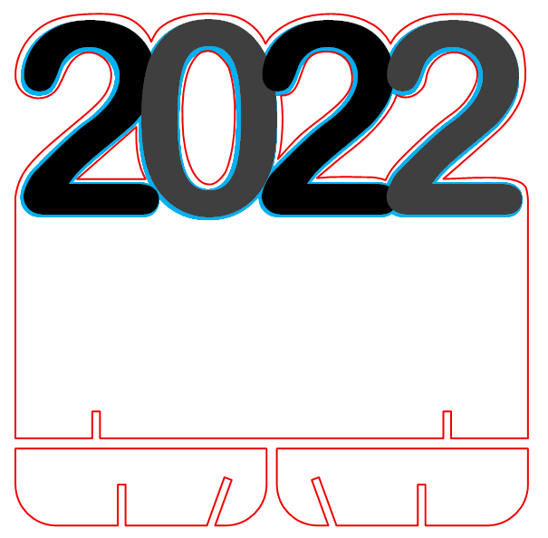
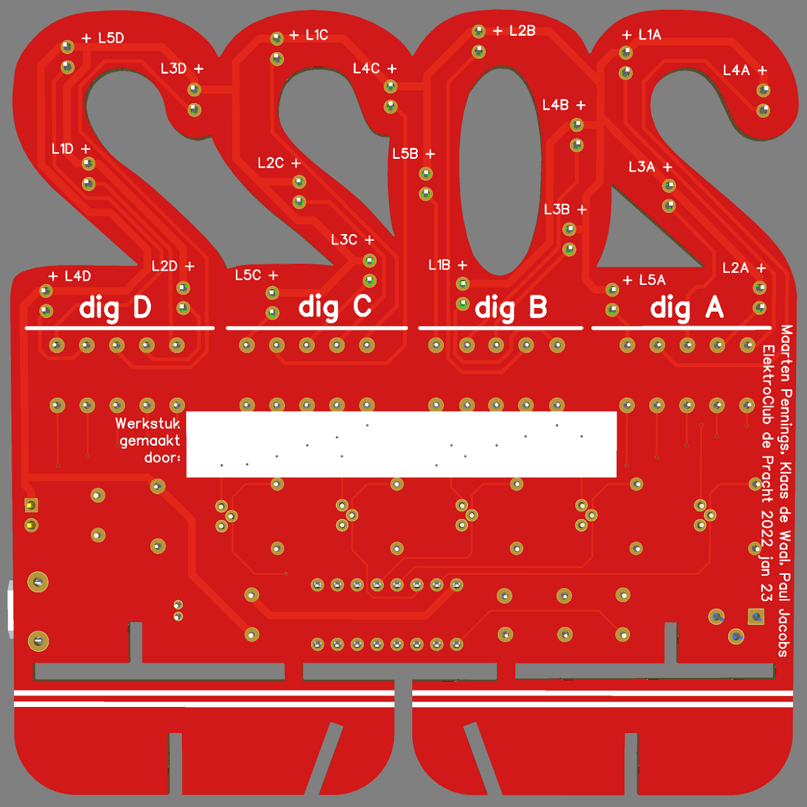

# ElektroClub2022

End-of-year project (2022) for the ElektroClub.

## Introduction

In my village I'm volunteer for an "ElectroClub" for children 8 to 12 years.
At the end of the (school) year we try to have a master piece for them, to remember the club.
In 2022 we wanted the year digits with flashing numbers; this is actually a copy of an old project:

  

What we remembered from 2014 is that creating the wooden panels, soldering all the LED wires, 
and gluing all wires in place, was too time consuming.
This year we will try a variation: designing the PCB using [EasyEDA](https://easyeda.com)
and manufacturing it via [JLCPCB](https://jlcpcb.com/). 
The biggest challenge is to get a nice rendering of the big digits 2022.

We have minutes of the project in [Word](ElektroClub2022-plan.docx) or [pdf](ElektroClub2022-plan.pdf) - sorry they are in Dutch.

## Schematics

The 2014 schematics were lost in time, so we needed to do some googling.
The heart of the circuit is the [4060 binary counter](https://www.ti.com/lit/ds/symlink/cd4060b.pdf):

The schematics is based on one from [buildcircuit](https://www.buildcircuit.com/diy-kit-8-happy-birthday-led-flashing-diy-kit-using-cd4060-and-music-chip/).
However, we have 5 groups of LEDs, not three. And we added some capacitors for stabilization.

We will use the 4060 outputs to flash the LEDs; here are some time [calculations](timing.xlsx).

We were initially puzzled by the diodes, we now believe they form a "wired OR", 
resetting the CD4060 when all three (five) transistor basis are high.
This is when the CD4060 reaches 0b...111 (0b...11111). 
In that situation all LEDs are off. 

In other words at the same moment all LEDs are switched off, 
the CD4060 is reset and outputs 0b...0000 and all LEDs are on.

Our final [schematic](schematic.pdf).

## Stand

I wanted the PCB to have small feet.
I made a [3D model](standmodel) to check the positions and lengths of the slots.

## PCB (with fancy board outline and silk print)

A step that took quite some time was the [design](pcboutline) of the board outline.
This includes the big "2022" digits, that I wanted to cut out.
I made the design in Visio, because that can save to DXF, the format needed by the PCB tool.

The resulting PCB as a render, front and back side.

Find the whole design on [oshwlab](https://oshwlab.com/maartenpennings/elektroclub2022).
The [gerber](Gerber_ElektroClub2022_pcb.zip) is also available separately.

## Order

I ordered 5 red, 10 green and 5 black at [JLCPCB](https://jlcpcb.com/); 
pricing: €1.76, €4.41, €3.53 respectively plus €15.85 shipping. Total €25.55.

The resulting PCBs are great looking. 

## Cost 

Find below the cost of the boards and components.
The LEDs, transistors, and resistors came from our stock, so I have added "guessed" prices.
We might have ordered too few IC sockets and/or USB connectors.

  | ID |      Name	     | Designator      | Footprint	        |Quantity | For 20 boards | Ordered  |
  |:--:|:---------------:|:---------------:|:------------------:|:-------:|:-------------:|:--------:|
  |  1 |       1u        | C1              | RAD-0.2            | 1       |       20      | [100(+100) for €3.02](https://www.aliexpress.com/item/1005001715033995.html) |
  |  2 |      10n        | C2,C3           | RAD-0.2            | 2       |       40      | 100 with (1) |
  |  3 |       1u        | C4              | CAP-D4.0×F1.5      | 1       |       20      | [50 for €1.90](https://www.aliexpress.com/item/1005002842732971.html) |
  |  4 |     1N4148      | D1,D2,D3,D4,D5  | DO-35              | 5       |      100      | [200 for €2.01](https://www.aliexpress.com/item/1005003540554760.html) |
  |  5 | HDR-M-2.54_1x2  | J1              | HDR-M-2.54_1X2     | 1       |       20      | Not mounted |
  |  6 | LED-TH-5mm      | L1A,L1B,L1C,L1D |                    |         |               |  |
  |    |                 | L2A,L2B,L2C,L2D |                    |         |               |  |
  |    |                 | L3A,L3B,L3C,L3D |                    |         |               |  |
  |    |                 | L4A,L4B,L4C,L4D |                    |         |               |  |
  |    |                 | L5A,L5B,L5C,L5D | LED-TH_BD5.0_GREEN | 20      |      400      | From stock [Guess 500 for €4.66](https://www.aliexpress.com/item/1005003483614644.html) |
  |  7 |     BC557       | Q1,Q2,Q3,Q4,Q5  | TO92               | 5       |      100      | From stock [Guess 100 for €2.24](https://www.aliexpress.com/item/32868211649.html)|
  |  8 |       1M        | R1              | R_AXIAL-0.3        | 1       |       20      | From stock [Guess 100(+100+100+100) for €3.80](https://www.aliexpress.com/item/32979849787.html)|
  |  9 |      180        | R1A,R1B,R1C,R1D |                    |         |               |  |
  |    |                 | R2A,R2B,R2C,R2D |                    |         |               |  |
  |    |                 | R3A,R3B,R3C,R3D |                    |         |               |  |
  |    |                 | R4A,R4B,R4C,R4D |                    |         |               |  |
  |    |                 | R5A,R5B,R5C,R5D | R_AXIAL-0.3        | 20      |      400      | From stock - Guess 100 with (8) |
  | 10 |      15k        | R2              | R_AXIAL-0.3        | 1       |       20      | From stock - Guess 100 with (8) |
  | 11 |     200k        | R3              | 9.5X9.6MM2-POTMETER| 1       |       20      | [25 for €5.48](https://www.aliexpress.com/item/32783054938.html) |
  | 12 |     220k        | R4              | R_AXIAL-0.3        | 1       |       20      | From stock - Guess 100 with (8) |
  | 13 |   CD4060BE      | U1              | DIP-16             | 1       |       20      | [30 for €2.52](https://www.aliexpress.com/item/1005001345739246.html) |
  | 14 |   micro USB     | USB1            | 2-PIN power only   | 1       |     **20**    | [**20** for €2.00](https://www.aliexpress.com/item/32931657320.html) |
  | 15 |  dip 16 socket  | U1              | DIP-16             | 1       |     **20**    | [**20** for €1.75](https://www.aliexpress.com/item/1005001403007175.html) |
  | 16 |  ziplock bags   | -               | -                  | 1       |       20      | [100 for €3.64](https://www.aliexpress.com/item/1005003813481837.html) |
  | 17 |      pcb        | -               | 1                  | 1       |       20      | [20 for €25.55](https://oshwlab.com/maartenpennings/elektroclub2022) |
  |    |                 |                 |                    |         |               | From stock - Guess €10.70 |
  |    |                 |                 |                    |         |               | Ordered **€47.87** |
  |    |                 |                 |                    |         |               | Total cost €58.57 (**€2.93/piece**) |

## Instructions

There is an instruction leaflet for assembling the PCB:
a [doc](ElektroClub2022-manual.docx) or [pdf](ElektroClub2022-manual.pdf) version.
Since the leaflet is for the children, it is in Dutch.

(end)
