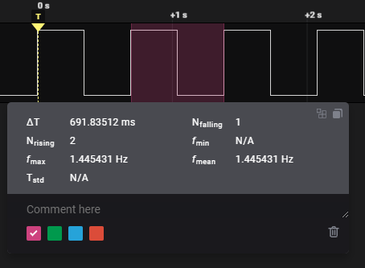
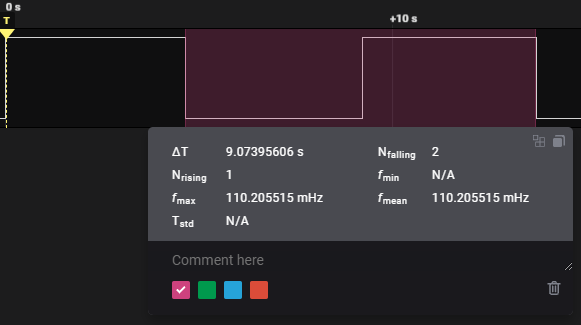
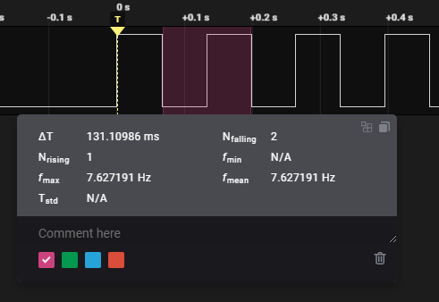
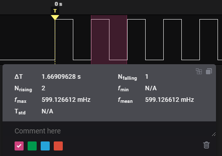
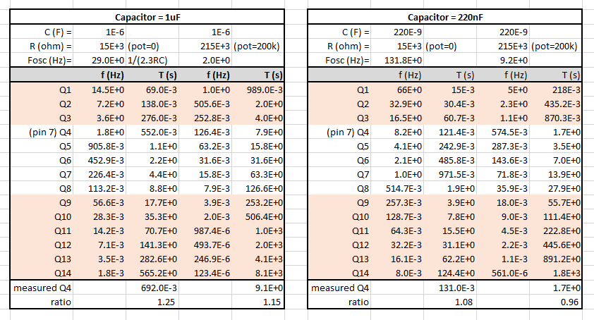
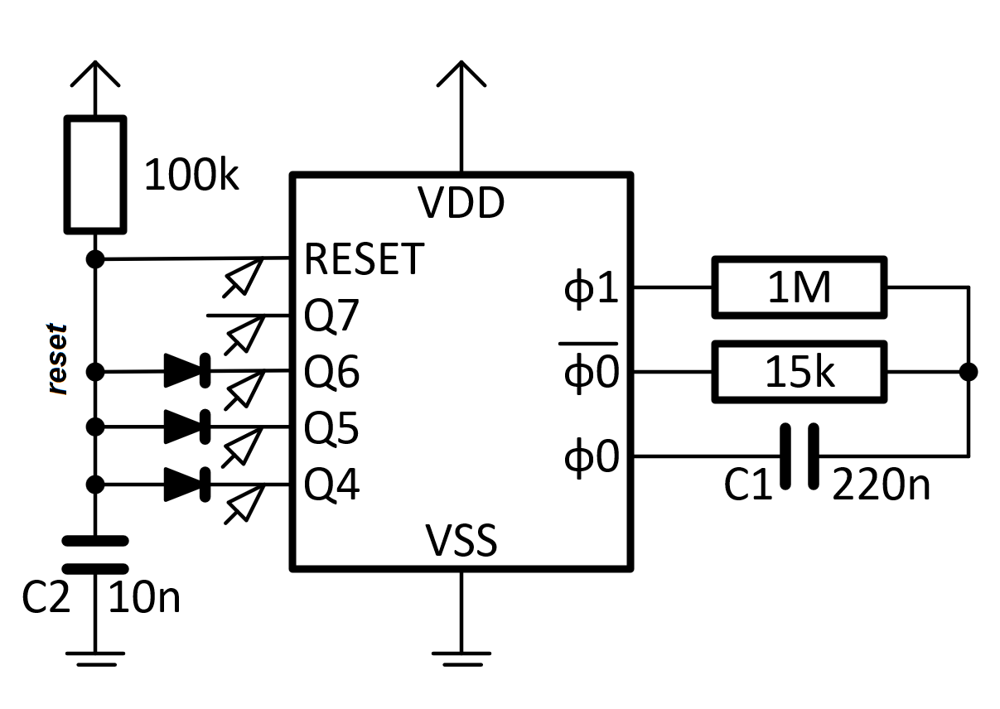
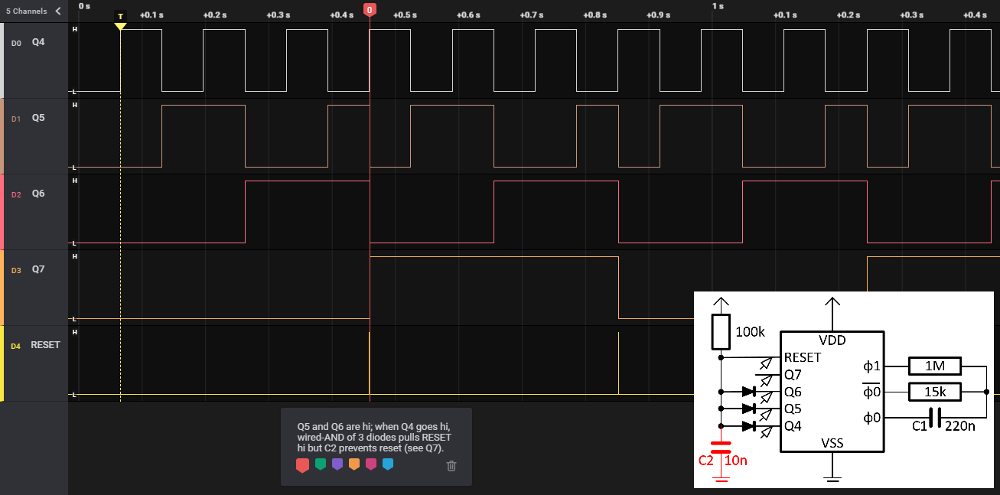
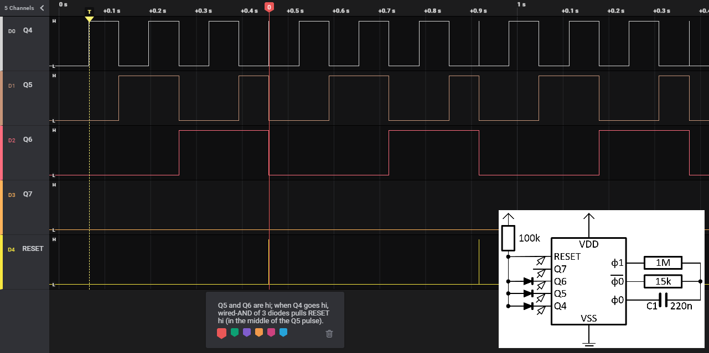
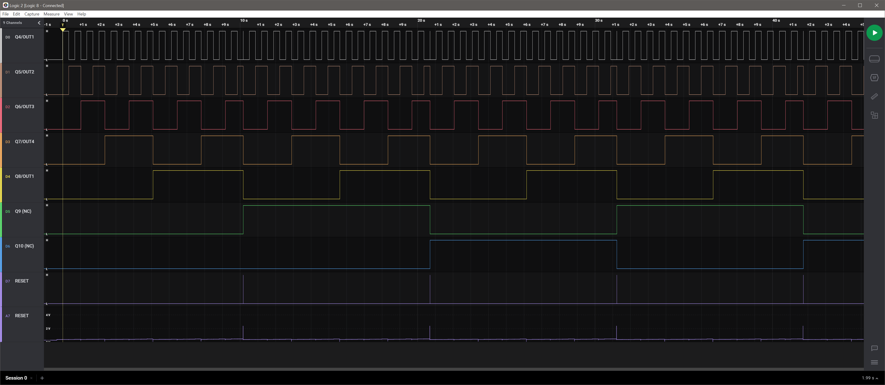

# Debug

The PCB was not behaving completely as expected:
the timing was off, and although the external reset behavior was ok (no all-off LEDs) 
the logic analyzer showed a funny picture.

## Timing

On the logic analyzer we measured the frequency on output pin 7/Q4.

We started with the clock capacitor (C1) at 1µF and the potentiometer (R3) at min and max.

We measure a cycle time of 692ms respectively 9.1s.
That is about a factor 5 off what we planned. 

We replaced the clock capacitor (C1) with 5× smaller one: 220nF.
Now the logic analyzer gives us (with the potentiometer (R3) at min and max).

We made two errors.
 - We took as Fosc 1/RC. With 15kΩ en 1µF we get Fosc = 66.7Hz as in the original schematics.
   The datasheet (Nexperia HEF4060) explains that Fosc = 1/(2.3RC).
 - In the ST schematics Q4 de fourth divider, but in the Nexperia schematics Q4 de third.

The new timing computations - comparing the 1µF case (left) with the 220nF case (right) - are as follows.

# Reset

I made a smaller version of the system with just 4 outputs.

The arrows show where the probes of the logic analyzer are.

Recall that the chip resets when the RESET pin goes high. 
It is connected to a pull-up.
But as long as one of Q4, Q5, or Q6 is low, the _reset_ net is low.
Only when all Qs are high, the _reset_ net goes high and thus the RESET pin, so that the chip resets.

These are the Saleae traces [with C2](timing-with-C2.sal) and [without](timing-no-C2.sal), 
and here are a screenshots of these traces.

The C2 prevents a "full" reset of all outputs.

What probably happens is that when all lines are hi, the chips starts to reset.
One of the outputs is reset first (depending on chip design, maybe varies per batch),
this cause the _reset_ net to go low, and this prevents other output stages to reset.

We removed the C2 from the real board.

Around 10ms, the reset comes (see D7, but note that the A7 is rather low) as D1/Q5/OUT2 is aborted.
But D5/Q9 stays high. It even appears that D6/Q10 has become the inverse of D5/Q9.

As a next step, we lowered R4 (the pull-up for RESET) from 220k to 10k.
This finally gives the expected trace. Still, the spike in A7 is rather low.
That makes sense, because immediately after reset the RESET line is de-asserted.

# Conclusions

 1. Clock capacitor C1 must be changed to 220nF
 2. Reset pull-up R4 could be changed to 10k - but without this change it does a partial reset
 3. Reset capacitor C2 could be removed - but without this change it does a partial reset

Only 1 is really necessary, shall we also do the other two errata?

(end)
