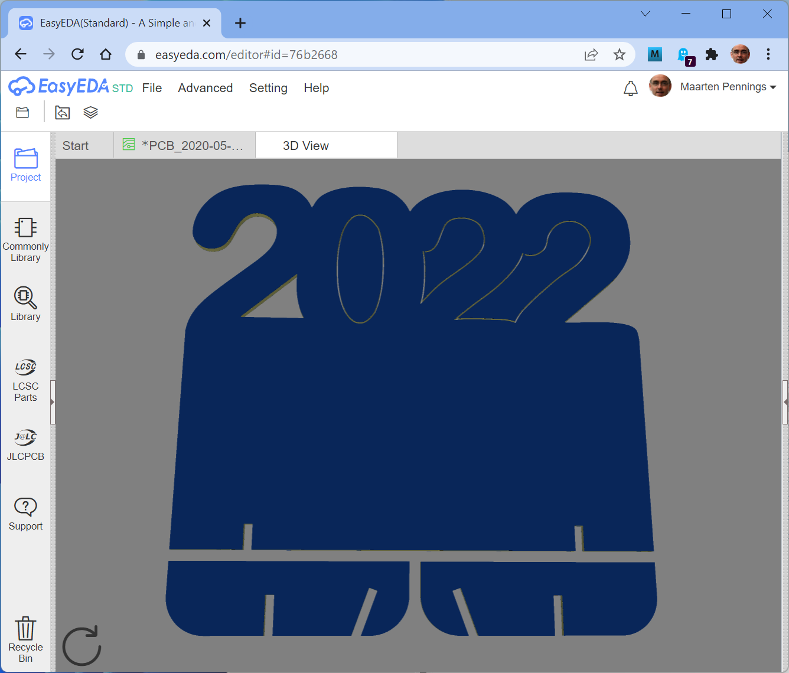
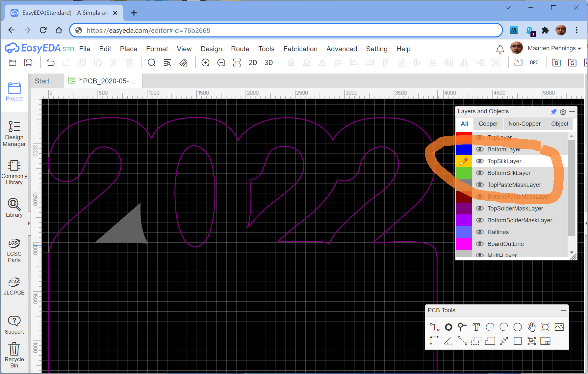
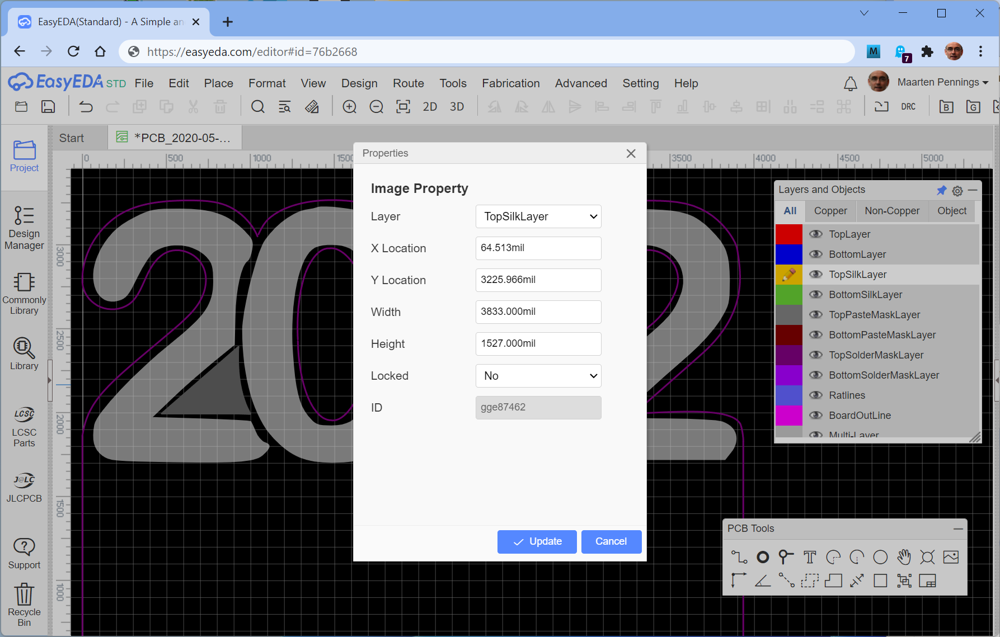

# PCB outline

Non-rectangular board outline and fancy silk print
in [EasyEDA](https://easyeda.com) and [JLCPCB](https://jlcpcb.com/). 

Find the design on [oshwlab](https://oshwlab.com/maartenpennings/elektroclub2022).

## Introduction

We want big digits.
Those digits need to stand out.
We achieve this in two ways:
 - partially "cut them out", i.e. complex PCB outline
 - "paint" them, either via silk print or via metal
 
[EasyEDA](https://easyeda.com) has an import mechanism for both.
For an outline, it needs a vector description via a so-called [DXF file](https://en.wikipedia.org/wiki/AutoCAD_DXF).

For the silk print it needs a bitmap via a jpg, png, gif, bmp or SVG file.

I had one tool that support both, VISIO.

## Visio

I've drawn the 4 digits in Visio using "Arial Rounded MT Bold" at 150pt.
At this size, the four digits span 100mm, the target width of the PCB.

I rendered the digits twice, once bold (blue) and once non-bold (black/gray).
The black/gray will be exported as png for EasyEDA silk screen.

I used the blue as a reference for a hand crafted outline.
The blue (bold) was a bit bigger than black (non-bold) but not much bigger, 
so my handcrafted outline (Visio line tool) is about 1mm away from the blue.
The drawing includes the slots and the feet from the 3D model.

Here is a visualisation of the [Visio](outline.vsdx) drawing

.

I did two separate exports, the red lines to a [DXF file](outline.dxf)
and the black/gray digits to a [png file](letters.png).

## Outline

The outline (and especially board cut-outs are the hardest).
In the [EasyEDA](https://easyeda.com) PCB editor, import the DXF file.

Press `Select a DXF file...` and browse to `outline.dxf`.
Also make sure to import on layer `BoardOutLine`.

Note that a DXF file has units and length, so the outline has the correct dimensions.
You might want to use `Place > Set canvas Origin > By Mouse Location` to set the origin
(and use middle-mouse-button with moving the mouse to **pan** and ctrl-middle-mouse-button with a wheel-roll to **zoom**).

If you click the outline (purple line) with the mouse it will light up white to indicate selection.
What we do see is that the outline is not one curve but multiple segments 
(in the image below, we see a selection of a small wedge).
Even more importantly, the segments are not fully connected (in the image below red encircled).

You can drag a green dot of one segment to the end of another segment. I suggest to also drag the end of that other segment
so that both ends snap to the same grid point.

For the inner holes we need to go one step further. 
Not only do the segments need to be _connected_ (overlapping end-points), they need to be _continuous_.
So after you manually moved the end-points of the segments to overlap, select all the segments that make up one hole.
Either drag a rectangle around all, or use CTRL-click to add (actually toggle) segments to the selection.
Once all segments are selected right-click on the black canvas (not on a segment!) and select `Combine to Continuous Track`.

Note: try right click again with the segments/track selected, if the `Combine to Continuous Track` remains in the right click
menu, the end-points did not overlap well enough - I suggest to drag all endpoints to a grid point.

Once that is done, the track can be converted to board cutout.
Select the track, use the right-click menu and select `Convert to Board Cutout`.

If the polygon (cutout) is _not_ filled gray, the track was not closed. Drag end-points to make sure they overlap;
again I suggest to drag all endpoints to a grid point.

The 3D View menu is a good way to check the cutout was successful.

## Silk print

In an image editing programs (MS Paint), I added some white between the digits.

 

In the [EasyEDA](https://easyeda.com) PCB editor, start by selecting the 
correct layer for the import - in our case the `TopSilkLayer`. 

Next start the dialog to import the png file. 

Select `letters-edited.png` as image file.
Note that EasyEDA doesn't care about black or gray, it imports the png in two-tone (black and white) - this
is governed by the `Color Tolerance` slider.

Bitmap images do not carry real world size. So it is important to measure (in the original Visio file)
what the width of the `2022` is. In our case that is 97.4mm, so fill that in on the bottom (and select `mm`).
The aspect ratio is maintained.

Now drag the image to the correct position.
If the image is a bit off in size, or on the wrong layer, right click and select `Properties`.
In the window that pops-up the width, height, layer can be changed.
Note that here the aspect ratio is _not_ maintained.
You can not select the units in this windows; our 97.4mm is rendered as 3833mil.

This is also available in the panel on the right `View > Right-Hand Panel` - assuming the image is selected (white).

## Warning

The 3D view in EasyEDA is nicely rendering our design.

When we want to manufacture, we generate a Gerber file. That also looks fine.

When we import the Gerber in [JLCPCB](https://jlcpcb.com/), we see that the internal cutout holes
are not rendered correctly. 

No worries though, the end-result is still ok.

(end)
