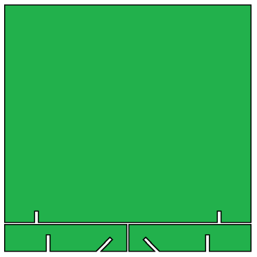

# Stand model

I modeled (in [Fusion 360](https://www.autodesk.eu/products/fusion-360)) how the PCB could stand vertically using feet made as part of the PCB.

## Idea outline

The key idea is to use slots to join two planes.

The maximum PCB size of the "makers deal" at [JLCPCB](https://jlcpcb.com) is 100 _mm_ by 100 _mm_ (actually 4 _in_ by 4 _in_).
The two feet are made of a 15 _mm_ strip at the bottom (full length 0f 100 _mm_), 
so the main part is for the actual PCB: 83 _mm_ by 100 _mm_. Note that 15 plus 83 is 98, we have 2 _mm_ for separation slits.

I decided that each foot has _two_ slots: one straight and one at 70 degrees so that you have two options for the stand: 
straight and slanted.

## Dimensions

The PCB thickness is 1.6 mm, to have a tight fit I made the slots 1.5 mm.
Worst-case we need to do some sanding to make them wider, and/or hot-glue to make them stay.

## Artist impression

Modeling the slanted and straight positions of the PCB 

## Next step

Next step is to create the actual "board outline" for the PCB.
This includes gaps for the digits. See [pcboutline](../pcboutline).

(end)
